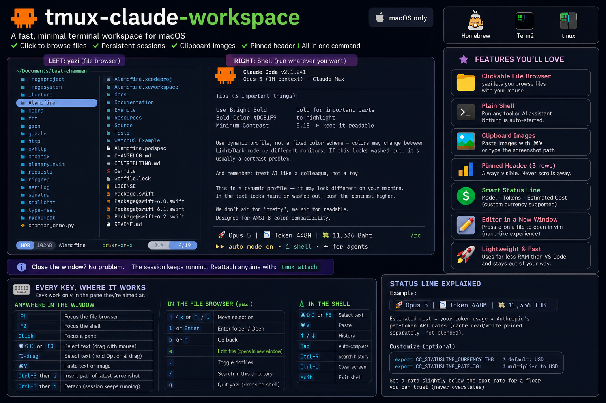
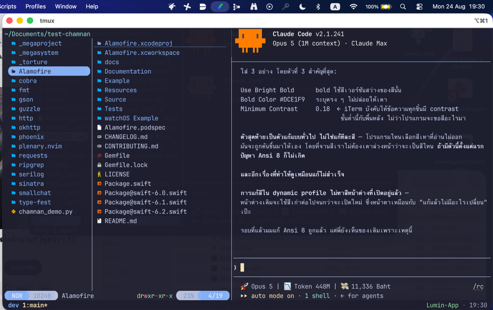
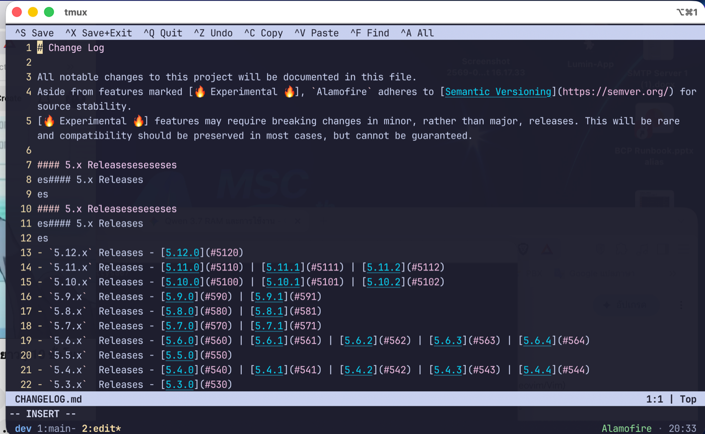

# tmux-claude-workspace

A terminal workspace for macOS: a file browser you can click, a shell that survives closing the
window, working clipboard images, and a pinned header — set up by one command.



---



*Left: yazi, two columns. Right: a plain shell with Claude Code running in it — nothing here starts
that for you. Above it: the pinned banner. The Thai in the screenshot is not decoration; combining
scripts are one of the things a terminal setup gets wrong by default, and this one does not.*

> **macOS only.** This depends on Homebrew, iTerm2 dynamic profiles, and the macOS pasteboard.
> The tmux and yazi configs would port to Linux; the installer, the profile and the image handling
> would not, and pretending otherwise would waste your afternoon.

---

## Why

I wanted to stop opening five VS Code windows. Measured on this machine, one VS Code window across
its 17 processes held **425 MB** resident, while iTerm2 + tmux + yazi together held **97 MB** —
about **4.4× less**, and the gap grows with each editor window because each one is another
renderer process.

But moving to a terminal meant losing three things, and they were the things that mattered:

1. **No folders to click.** `cd` and `ls` are fine until you are exploring an unfamiliar tree.
2. **No clipboard images.** Screenshot something, and there was no way to hand it to a tool that
   wanted a file.
3. **Nothing to look at.** A blank prompt tells you nothing about where you are or what is running.

This repo is the answer to those three, and nothing more. It is a **shell**, not a workflow: it
sets up the window, the panes and the look. What you run in the right-hand pane is your business.

---

## What you get

| | |
|---|---|
| **Left pane** | [yazi](https://github.com/sxyazi/yazi) — a file browser you click through, two columns wide so filenames actually fit |
| **Right pane** | A plain shell. Run whatever you like. Nothing is auto-started. |
| **Above it** | A three-row banner that never scrolls away |
| **Editing** | `e` on a file opens an editor in its own window — vim, set up to feel like nano |
| **Session** | Outlives the window. Close the terminal, let the Mac sleep, come back — it is still running. |
| **Clipboard** | `⌘V` pastes images into tools that accept them · `prefix + i` types the path of a screenshot file |
| **Prompt** | [starship](https://starship.rs), scoped to this terminal only |
| **Status line** | Two rows: model, tokens, estimated cost and uncommitted files; then the 5h and weekly quota gauges — see below |

### The status line


Two rows. The first is what has been *spent*, the second is what is *left*:

```
🚀 Opus 5 | 📉 Token 848M | 💸 15,860 THB | 📝 3 No-Commit
⏳ Limit : 5h[■■■■■]96% rst:6m | 1w[■■■■□]72% rst:2d 22h
```

Only the first row costs anything to draw — it walks the day's transcripts, which is why it is
cached. The second row is free: Claude Code hands both quota windows to the status line on stdin.

### About the money on row one

**That figure is an estimate, not a bill.** It is your token counts multiplied by Anthropic's
published per-token API rates, with cache-read and cache-write priced separately rather than
blended — a blended rate charges cache reads at the full input rate and overstates badly.

On a subscription plan you are **not** charged this. The number exists to answer one question: what
would this week's work have cost through the API? That is how you tell whether the plan is earning
its keep, and it is the only reason the line is there.

Two knobs, both optional:

```bash
export CC_STATUSLINE_CURRENCY=THB   # label shown after the number (default: USD)
export CC_STATUSLINE_RATE=30        # multiplier applied to USD (default: 1)
```

Pick a rate slightly *below* the spot rate. The point is a floor you can trust, not an exact
conversion — a figure that never overstates is more useful than one that is occasionally precise.

### The uncommitted-file count

```
📝 3 No-Commit
```

Three files are changed, staged or untracked and not yet in a commit. It appears only when there is
something to report — a clean tree prints nothing, so the line stays quiet when there is nothing to
say.

The reason it exists: nothing else in the terminal tells you. A prompt shows the branch, not whether
work is sitting in it, and if you commit many small times a day the state you most want at a glance
is the one with no indicator anywhere. Untracked files are counted too — a new file nobody has run
`git add` on is exactly the kind of work that goes missing.

It runs `git status` on every render rather than caching it, because a cached count would be worse
than none: the whole point is the state right now. Measured at 0.06s on a 200-file repo. Outside a
git repository it prints nothing at all.

### The quota gauges on row two

```
⏳ Limit : 5h[■■■■■]96% rst:6m | 1w[■■■■□]72% rst:2d 22h
```

How much of each subscription window you have used, and how long until it resets. Pink is the
5-hour window, blue the weekly one. Red is deliberately not used for either — it is left free to
mean "nearly out" if you want to add that.

This row costs nothing to draw. Claude Code already hands both windows to the status line on stdin
(`.rate_limits.five_hour` and `.seven_day`), so unlike the figures above it there is no scan, no
cache, and nothing that can go stale. On an account with no subscription window — an API key, or a
Claude Code older than 2.1 — the row is simply not printed.

It is a second row rather than four more segments on the first because the first had run out of
room: adding them there pushed the uncommitted-file count past the edge of the pane, where it was
silently truncated away.

The bar is five cells because five is what divides a percentage: one cell is exactly 20%, so the
bar can be read as a fraction and never disagrees with the number beside it by more than half a
cell. Six cells could not — 72% filled four of six, which reads as 67%. Any usage at all lights one
cell, so 1% cannot look untouched; from 90% up the bar is full, and the number beside it is what
separates 90 from 100.

It is drawn with `■` and `□` rather than `█`/`░`, because a full block fills the cell top to bottom
and stands taller than the text next to it. One caveat: those two squares are East Asian
*ambiguous* width, so a terminal configured to draw ambiguous glyphs double-width will draw this
row twice as wide. Nothing on the row is column-aligned, so it costs width and nothing else — but
if it ever looks stretched, `▄`/`▁` and `█`/`░` are box-drawing and unambiguously single-width.

### Turning it off

Delete `~/.claude/statusline-command.sh` and remove the `statusLine` key from
`~/.claude/settings.json`; or replace the script with your own, since all it has to do is print a
line or two to stdout.

## Every key, and where it works

A key only does something in the pane it is aimed at, so that column matters more than the key.

### Anywhere in the window

| Key | Does | Notes |
|---|---|---|
| `F1` | Focus the file browser | |
| `F2` | Focus the shell | |
| Click | Focus a pane | |
| `⌘⇧C` or `F3` | Select text with the mouse: drag, release, it is on the clipboard | `Esc` backs out |
| `⌥`-drag | Same thing without a key first — hold Option and drag | Built into iTerm2 |
| `⌘V` | Paste. Text pastes as text, an image attaches as an image | See the clipboard section |
| `Ctrl+B` then `i` | Type the path of the newest screenshot into the shell | For `⌘⇧4`, which saves a file |
| `Ctrl+B` then `d` | Detach. The session keeps running; reattach with `tmux attach` | |

### In the file browser (yazi)

| Key | Does |
|---|---|
| `j` `k` or ↑ ↓ | Move the selection |
| `l` or `Enter` | Enter the folder |
| **`b`** or `h` | Go back up one directory |
| **`e`** | **Edit the highlighted file** — opens in its own window |
| Click | Select a file or enter a folder |
| `.` | Show or hide dotfiles |
| `/` | Search in this directory |
| `q` | Quit yazi. The pane drops to a shell; type `yazi` to bring it back |
| `⌘⇧C` or `⌥`-drag | Copy text out of the preview column on the right |

### In the editor (after `e`)

It opens **already in typing mode** and the top line lists these, so there is no mode to learn and
nothing to look up. Every one of them works whichever mode you have wandered into.

| Key | Does |
|---|---|
| `^S` | Save |
| `^X` | Save and exit |
| `^Q` | **Quit without saving** — the file is untouched until you save, so this undoes a whole session |
| `^Z` / `^Y` | Undo / redo |
| `^C` / `^V` | Copy / paste, against the **system** clipboard |
| `^A` | Select all |
| `^F` | Find |
| Drag | Select text with the mouse |

> Because it opens in typing mode, a stray keypress types a character. Nothing is written to disk
> until `^S` or `^X`, so `^Q` gets you out of any mess with the file exactly as it was.

### In the shell

Whatever you run there owns the keyboard. The workspace adds one thing:

| Key | Does |
|---|---|
| `Shift+Enter` | Insert a newline instead of submitting, in tools that read meta-Return |

---

## Moving around in the file browser

yazi opens in the left pane. Click a folder to enter it, or use the keyboard:

| Key | Does |
|---|---|
| `j` / `k` or ↑ ↓ | Move the selection |
| `l` or `Enter` | Enter the folder / open the file |
| **`b`** or `h` | **Go back up one directory** |
| `.` | Show or hide dotfiles |
| `q` | Quit yazi (the pane drops to a shell; type `yazi` to bring it back) |

`b` is the addition here — `h` is yazi's own default and still works. `b` is easier to reach for
if you did not arrive from vim, and having two keys for the same move costs nothing.

The pane shows **two** columns, not yazi's default three. The dropped one is the parent directory:
it answers a question you already know the answer to, and in a sidebar it takes width away from the
only column with anything to say. With it gone, filenames actually fit.

### Selecting text, and why it needs a key

yazi asks the terminal for mouse reporting so that folders can be clicked. Once it does, tmux hands
it every click and stops using them for selection — the two cannot both have a plain drag.

**`⌘⇧C`** (or **`F3`**) lends the mouse back for one selection: it enters tmux's copy mode,
dragging selects normally, and releasing the button copies straight to the system clipboard and
leaves copy mode again. One key, one drag, done. `Esc` backs out without copying.

Holding **`⌥`** while dragging also works and needs no configuration at all — iTerm2 bypasses
mouse reporting while the key is held. `⌘⇧C` exists because that is not something anyone
discovers.

Both work **inside yazi's preview column**, which is the place you most often want them: hover a
file, read it on the right, drag out the line you came for. Neither disturbs yazi — the preview is
not a text editor and never becomes one, you are selecting what is painted on the screen.

### Editing a file without leaving the browser



*Pressing `e` on a file opened it in its own tmux window — see `2:edit*` in the bar at the bottom,
next to the `1:main` you came from. The workspace window is untouched behind it. `^X` saves and
closes, and tmux drops you straight back into `1:main`.*

Press **`e`** on a file and it opens in an editor in its own tmux window. The workspace window is
not touched at all, and tmux returns to it when you exit — nothing to restore, because nothing was
disturbed.

The editor is **vim, configured to behave like nano**: it opens in insert mode, the Ctrl keys above
are the nano ones, and the top line lists them. It is launched with `vim -u`, so a personal
`~/.vimrc` is never loaded and anyone who already lives in vim keeps their own setup exactly as it
is.

> **Why vim and not nano.** Only one of them can drag-select. nano's own manual says so: *"Text can
> still be selected through dragging by holding down the Shift key"* — that is nano handing the job
> back to the terminal. vim asks for the SGR mouse protocol, which also works past column 223, and
> brings the system clipboard with it so `^C` reaches the rest of the Mac.
>
> Two shapes were tried before a window: `display-popup` floats above the window and receives no
> mouse events at all, and splitting a pane worked until you closed it — tmux hands the freed
> columns to whichever pane it prefers, which left the file browser two characters wide.

> **How it finds the filename**, which took longer than everything else: this version of yazi hands
> a shell command **nothing**. `$@`, `$0` and `$1` all expand to empty, an opener with no
> placeholder receives `ARGC=0`, and `%*` arrives literally — measured by making an opener dump its
> own argv and environment. `copy path` is the one channel yazi does fill, so the binding stashes
> whatever was on the clipboard, calls it, reads the path back, and puts the old clipboard contents
> back afterwards.

---

## Images and the clipboard

Three different things, and it is worth knowing which one you want.

### 1. `⌘V` — paste, including images

The bundled iTerm2 profile maps `⌘V` to send `0x16` (which is `ctrl+v`). This is not a workaround
for a broken paste; it is an upgrade, because in Claude Code `ctrl+v` handles **both**: text on the
clipboard pastes as text, an image on the clipboard attaches as an image.

Plain iTerm2 `⌘V` pastes text only, so an image on the clipboard produced nothing at all. Now it
does the Mac thing you expect.

On macOS, put an image on the clipboard with **`⌃⌘⇧4`** — Control held down while you take the
screenshot. Without Control, `⌘⇧4` writes a **file** to the Desktop and the clipboard stays empty,
which is what the next two are for.

> One real cost, and it is stated in the profile too: this mapping belongs to the profile, not to
> any one program, so `⌘V` sends `0x16` to whatever is running in the pane. At a bare shell prompt
> that is zsh's *quoted-insert*, so `⌘V` stops pasting text there. Delete the `0x76-0x100000` entry
> from the profile to get the old behaviour back.

### 2. `Ctrl+B` then `i` — paste a screenshot **file** as a path

For the `⌘⇧4` case, where the picture is a file on the Desktop and never touched the clipboard.
This finds the newest screenshot (within the last 10 minutes) and **types its path** into the pane.

Useful for anything that wants a path rather than an attachment, and for a picture that has to be
opened more than once. A path can be reused; a paste is consumed.

### 3. `cimg` — keep it, and get the path

```bash
$ cimg
/Users/you/.local/share/clipboard-images/clip-20260824-160241.png
  2400x1700 · 1898 KB
```

Saves the clipboard image (or the newest screenshot) under a permanent name, prints the path, and
leaves that path on the clipboard **as text** — so it survives being pasted anywhere. `cimg name`
saves it under a name you choose.

### Where the images go, and why the folder does not grow forever

Saved images land in `~/.local/share/clipboard-images/`. That folder **prunes itself**:

| Rule | Default | Override |
|---|---|---|
| Delete files older than | 14 days | `CLIPIMG_KEEP_DAYS` |
| Keep at most | 200 files | `CLIPIMG_KEEP_MAX` |

The prune runs **inside the capture itself**, at the one moment the folder can grow — so it cannot
outgrow its limit without the cleanup having just run. There is no cron job to install and nothing
to break quietly when you move machines, which is one fewer moving part than a scheduler.

Both rules are needed. Age alone is not enough: a heavy day of screenshots can put hundreds of
megabytes in there well inside the window, and the count is what catches that.

---

## Install

```bash
git clone https://github.com/YOUR-USER/tmux-claude-workspace.git
cd tmux-claude-workspace
bash install.sh
```

It prints exactly what it will do, tells you which packages are missing, and waits for you to
press `y`. Nothing is touched before that.

```bash
bash install.sh --dry-run   # print the plan, change nothing
bash install.sh --yes       # skip the prompt
bash uninstall.sh           # put it back
```

**It checks for and installs what is missing:** `tmux` (required), and `yazi`, `starship`, `eza`,
`pngpaste`, iTerm2 and JetBrains Mono Nerd Font (each optional — decline any and the matching
feature is simply absent). Existing configs are backed up to `.bak` before being replaced, and the
shell rc gets one marked block that is replaced in place rather than appended to.

Then: restart iTerm2, and open a window with the **Dev** profile.

---

## The defaults, and the screen they came from

Every size here was measured on a **1440 × 900** display (a 13-inch MacBook), which is the smallest
screen this is comfortable on. Quote that number when adjusting: a layout tuned on a 27-inch
monitor will look wrong here, and the reverse is worse.

| | Value | Where |
|---|---|---|
| Window | 73.5% × 74.1% of the screen — 1058 × 667 | `config/iterm-dev-profile.json`, and the launcher |
| tmux grid | 131 × 29 characters | derived from the above at 14pt |
| Split | 60% to the right pane — 51 / 79 columns | `config/dev-layout` |
| Banner | 3 rows | `config/dev-layout` |
| yazi columns | 23 : 34 | `config/yazi.toml` |

Sizes are stored as **fractions of the measured screen**, not pixels, so a different display lands
in proportion rather than off the edge.

---

## Changing it

Everything is a plain file, and none of it is precious.

- **The banner** — edit `~/.local/bin/claude-banner`, or set `CLAUDE_BANNER_TITLE` /
  `CLAUDE_BANNER_MODEL` in your environment. Delete the file and the banner pane is not created.
- **The prompt** — `~/.config/starship.toml`, or remove starship and use your own.
- **The folder it opens in** — one line in `~/.config/dev-layout/folder`.
- **The split** — the `-l 60%` in `~/.local/bin/dev-layout`.
- **Colours** — the `#rrggbb` values in `~/.tmux.conf` and the iTerm2 profile.

---

## Things that cost me an afternoon

Written down because none of them are guessable from the symptom.

**A Homebrew font installs quarantined, and macOS silently refuses to register it.** Icons render
as `?` with no error anywhere. Clearing the quarantine flag is not enough on its own — `fontd` has
to be restarted before it looks again. The installer does both.

**macOS does set `LANG` — to `C.UTF-8`.** So `export LANG="${LANG:-en_US.UTF-8}"` never fires, and
the minimal locale miscounts combining characters, which makes the cursor land in the wrong column
in Thai, Arabic, Devanagari and others. It has to be set, not defaulted.

**iTerm2 matches a key binding on the CHARACTER a key produces, not its position.** A binding on
`v` does nothing on a non-Latin keyboard layout, because that physical key produces something else.
The bundled profile registers `⌘V` under three characters for exactly this reason. If yours is a
fourth, add it — `keybytes` will tell you what your key actually sends.

**yazi does not enable mouse reporting unless you ask.** A terminal application that never requests
mouse events does not get any: tmux treats every click as a pane-selection gesture and clicking a
folder does nothing. `mouse_events` in `yazi.toml` is the fix.

**A tmux pane can swallow every keystroke without saying so.** The banner is a pane holding a
`read`. Focus lands on it, and the terminal appears frozen. It ships with input disabled *and* a
hook that bounces focus off it — both are required, and the right move is to remove the banner
rather than either guard.

**Bold can render darker than plain text, and no palette entry explains it.** Raising ANSI 8 fixed
the dim greys and bold was still unreadable, because bold is not a colour — it is a *rule* the
terminal applies to whatever colour is current, and iTerm2's default for that rule is not what you
want on a dark background. The profile now sets `Use Bright Bold`, an explicit `Bold Color`, and
`Minimum Contrast: 0.18`. The last one is the general fix: iTerm2 forces every piece of text to
keep that much contrast against the background whatever colour the program asked for, so an
application that picks an unreadable grey is corrected without the palette having to anticipate it.

**Colour changes reach a running session only when it reloads.** A dynamic profile edit does not
repaint a window that is already open — which looks exactly like the edit not working. Open a new
window before deciding a colour fix failed.

**Terminal greys can be invisible without looking broken.** ANSI colour 8 — what programs use for
secondary text like "Running 2 shell commands" or a timer — started at contrast 2.48 against the
background, which reads as the program printing nothing rather than as a colour problem. ANSI 0 is
deliberately left dark: it is barely used as text and it is load-bearing as a *background*, since
the banner paints the logo's eyes by switching to it. Raise 8, never 0.

**But raising ANSI 8 far enough to read breaks Claude Code's own dark theme.** That theme is
`dark-ansi`, which means it holds no colours of its own and takes everything from this palette — and
the band it paints behind *your* messages is ANSI 8. So the same value is doing two jobs that want
opposite things: as text it wants to be light, as a background it wants to be dark. Raised to 5.81
for the text, the band fell to 1.93 against the white text drawn on it, which is white-on-white and
unreadable.

ANSI 8 is `#363650` here, which reads the band at 7.99 and lets it blend into the page. Secondary
text drops to 1.42 and is close to invisible; that is a deliberate choice, because the message you
just typed is worth more than a timer. **If you want the faded text back instead, `#6B7192` is the
only value that clears 3.0 in both roles** — 3.47 as text, 3.27 as a band.

**These numbers are tuned for one specific setup, and yours may not be it.** Every ratio above is
measured against this palette, this background, and Claude Code on `dark-ansi`. Change any of the
three and the arithmetic changes with it:

| If you… | What happens |
|---|---|
| Use Claude Code's **light** theme | The band comes from a light-palette entry instead. A dark ANSI 8 is then the wrong end entirely. |
| Use `dark` / `light` rather than `dark-ansi` | Claude Code stops reading this palette at all and paints its own colours. Nothing here applies; use `/theme` → `Ctrl+E` instead. |
| Change the terminal background | Both ratios move, because contrast is a relationship, not a property of a colour. |
| Use a different terminal | Its ANSI 8 is a different colour and the band moves with it. |

So treat `#363650` as *a worked example of the method*, not a value to copy. The method is: find
which palette entry the band actually uses by sampling the pixels, then pick a value with the
contrast arithmetic rather than by eye. That transfers; the hex does not.

Two things worth stealing from how this was found. The colour was identified by sampling the actual
pixels of a screenshot, after six attempts spent editing Claude Code theme tokens that could never
have worked — under `dark-ansi` there is no colour in the theme to edit. And every value above is a
measured contrast ratio, not a judgement: eyes disagree about greys, the arithmetic does not.

**`keymap.toml` in yazi replaces the entire default table.** A file listing one binding leaves you
with a file manager that has one key. `prepend_keymap` is what you want.

---

## What this is not

- Not a Claude Code plugin. It sets up a terminal; anything you run in it is unmodified.
- Not a dotfiles framework. Four scripts and five config files, all readable in one sitting.
- Not cross-platform. See the note at the top.

## Licence

MIT. See [LICENSE](LICENSE).
